# ShūKatsu Log

## 就職活動を一元管理し、振り返りまで支援するWebアプリ

企業情報・応募状況・選考・ES・面接・予定を一元管理し、
蓄積した記録をAIで振り返ることができる就職活動支援Webアプリです。

「記録するだけ」で終わらず、
過去のESや面接内容を次の選考に活かせるサービスを目指して開発しています。

🌐 **[ShūKatsu Log β版を利用する](https://shukatsu-log-nu.vercel.app)**

<p align="center">
  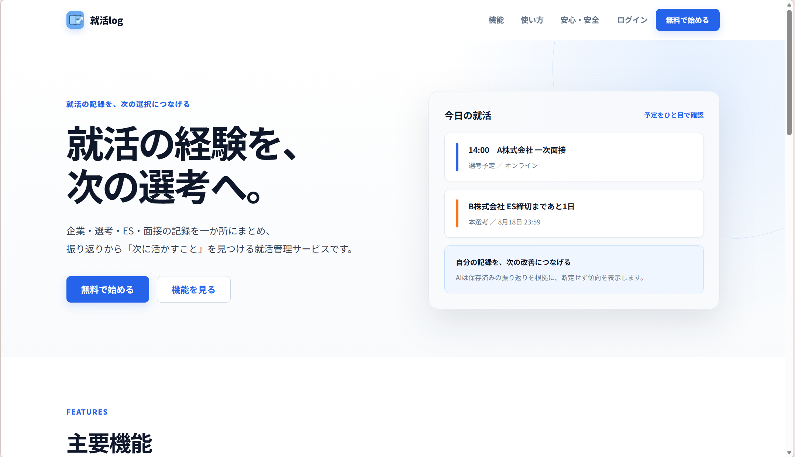
</p>

---

## 制作背景

就職活動では、

- 企業情報
- インターン・本選考
- ES
- 面接記録
- 選考結果
- 今後の予定

など、多くの情報を管理する必要があります。

これらをメモ・カレンダー・スプレッドシートなどに分けて管理すると、
情報が分散し、過去の記録を次の選考に活かしにくいという課題があります。

そこで、

> **就職活動に必要な情報を1か所にまとめ、  
> 記録した内容を次の選考へ活用できるサービス**

を目標として、ShūKatsu Logを開発しています。

---

# 開発体制

## 3人チームでの共同開発

3人で意見を出し合いながら企画・要件定義を行い、
その後は担当を分けて各機能の開発を進めています。

開発にはGit / GitHubを利用し、
各メンバーが実装した内容を共有・確認しながら、
レビューや統合を行っています。

### チーム全体で行ったこと

- アイデア出し・企画
- 要件定義
- 必要な機能の検討
- 各担当機能の開発
- Git / GitHubを利用した共同開発
- 実装内容の確認・レビュー
- 動作確認
- 改善案の検討

要件定義と開発は3人全員で行い、
UI設計・データベース・各機能の詳細実装などは、
担当を分けながら進めています。

---

# 自分の担当・役割

## チームリーダー

3人チームのリーダーとして、
自分の担当機能を開発するだけでなく、
チーム全体の開発が進むよう進行管理も行っています。

主に以下を担当しています。

- 開発全体で必要な作業の整理
- 次に実施する作業の決定
- メンバーへのタスクの割り振り
- 各メンバーの進捗確認
- メンバーから出た意見の整理
- 実装内容や変更内容の確認
- GitHub上でのレビュー
- 機能を統合した際の動作確認
- 発生した問題に対する改善方針の検討
- β版公開に向けた進行管理

単純に作業を割り振るだけではなく、
各メンバーの意見を聞きながら、

- 現在何が必要なのか
- 次に何を実装すべきか
- どこまで確認できれば次に進めるのか

を整理して開発を進めることを意識しています。

## 開発

要件定義と機能開発については、
チームメンバー全員で取り組んでいます。

自分自身も担当機能を実装しながら、
実際にアプリを使用して問題を確認し、
必要に応じて改善を行っています。

また、チーム全体の実装を確認しながら、
各機能を組み合わせた際に問題がないかについても確認しています。

---

# 主な画面

## 1. ダッシュボード

応募企業数、選考中企業数、インターン参加決定数、
直近の予定などを確認できます。

就職活動全体の状況を一目で把握できることを意識しています。

<p align="center">
  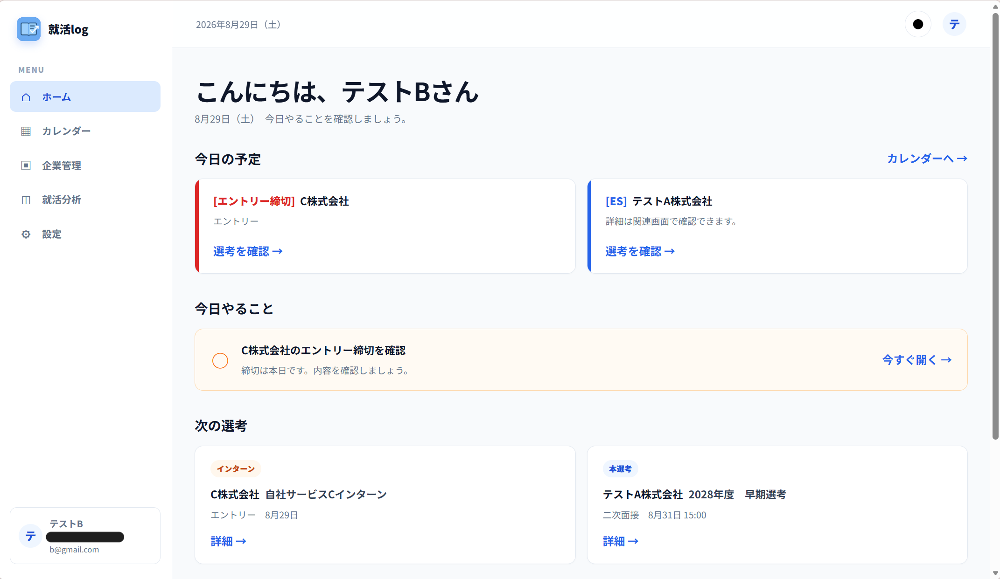
</p>

---

## 2. 企業一覧

登録した企業を一覧で確認できます。

企業ごとの情報を整理し、
目的の企業へすぐアクセスできるようにしています。

<p align="center">
  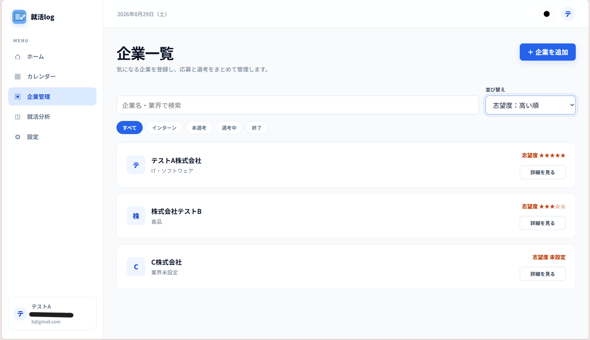
</p>

---

## 3. 企業詳細

企業を選択すると、
その企業に関する情報をまとめて確認できます。

企業情報だけでなく、
インターンや本選考などの応募情報にもアクセスできます。

<p align="center">
  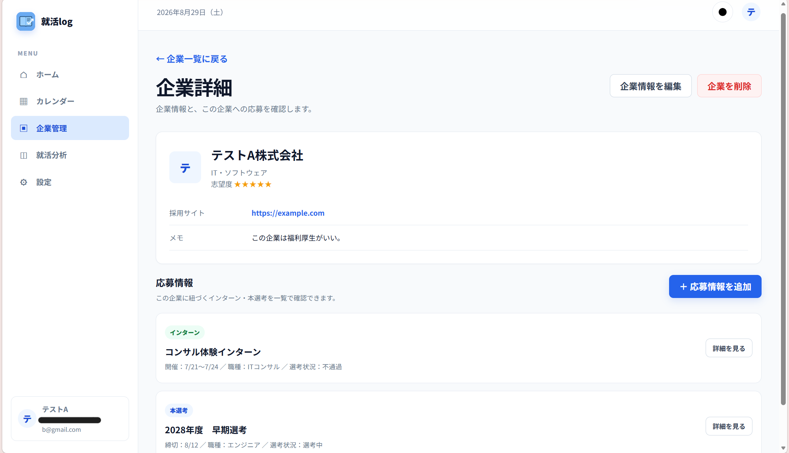
</p>

---

## 4. インターン・本選考管理

企業ごとにインターンと本選考を登録し、
応募状況や選考ステップを管理できます。

<p align="center">
  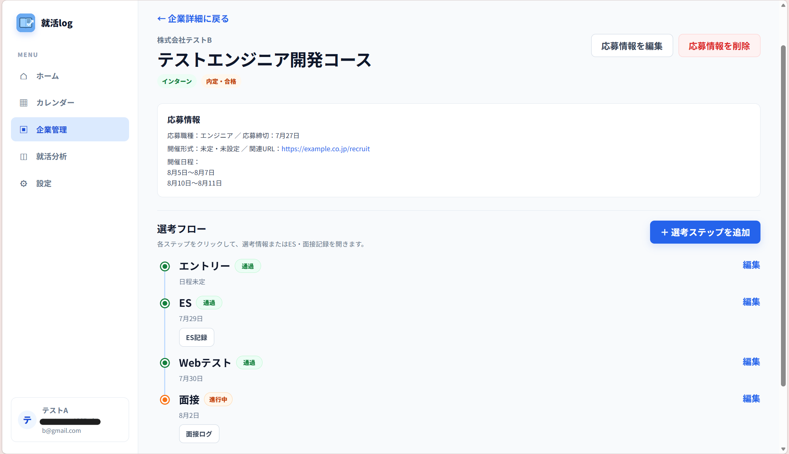
</p>

### 複数のインターン開催期間にも対応

当初は「開始日～終了日」の
1期間だけを登録する設計でした。

しかし実際には、

- 9月5日～6日
- 9月12日～13日

のように、
複数期間で開催されるインターンもあります。

そこで複数の開催期間を登録できるようデータ構造を変更し、
カレンダーや前日通知でも同じ日程情報を利用できるよう改善しました。

---

## 5. カレンダー

インターン・選考・手動で登録した予定などを
カレンダー上でまとめて確認できます。

<p align="center">
  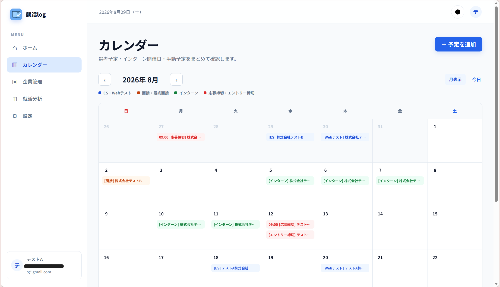
</p>

---

## 6. ES記録

ESで実際に出された質問と、
提出した回答・振り返りを記録できます。

過去のESを蓄積することで、
次のES作成や選考の振り返りに活用できます。

<p align="center">
  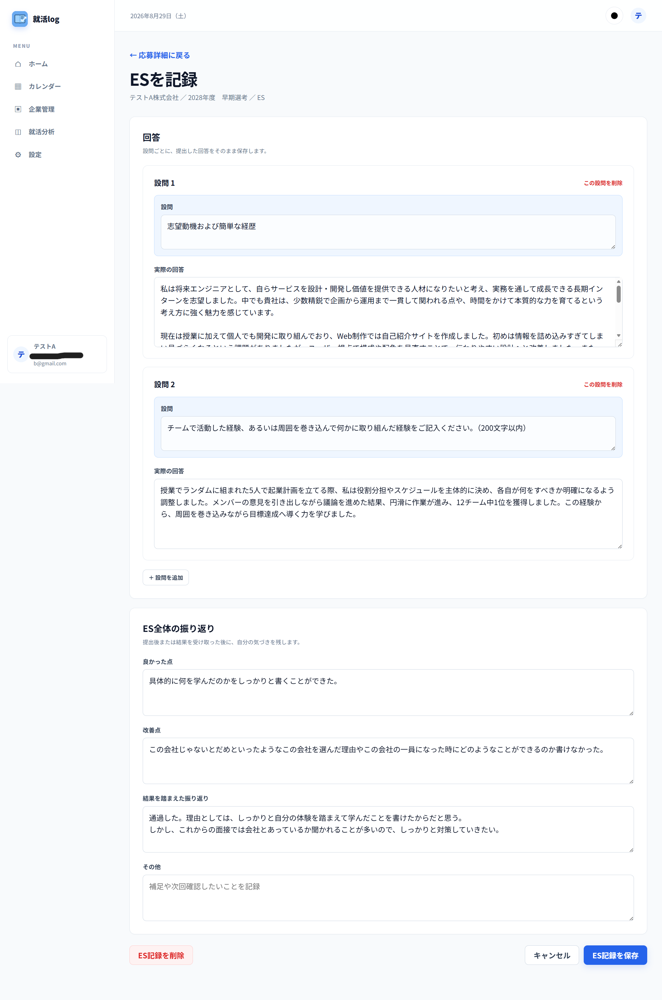
</p>

---

## 7. 面接記録

面接で実際に聞かれた質問と回答、
面接後の振り返りを保存できます。

<p align="center">
  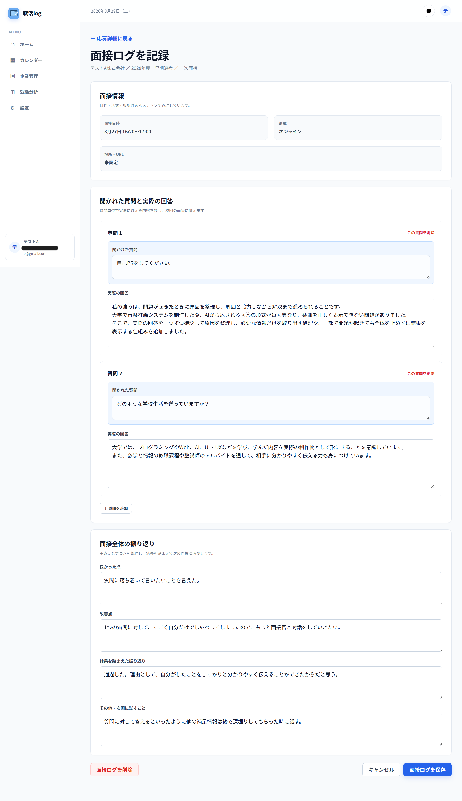
</p>

---

## 8. AI分析

蓄積したES・面接記録をGoogle Geminiで分析し、

- 良い傾向
- 改善ポイント
- 今後の行動

などを確認できます。

<p align="center">
  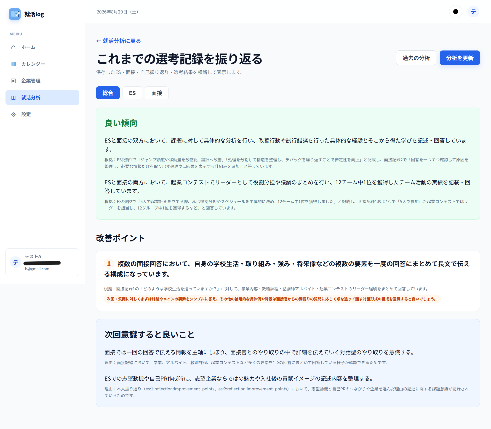
</p>

---

## 9. メール通知

インターンや選考などの予定を忘れないように、
対象となる予定の前日に自動でメールを送信します。

<p align="center">
  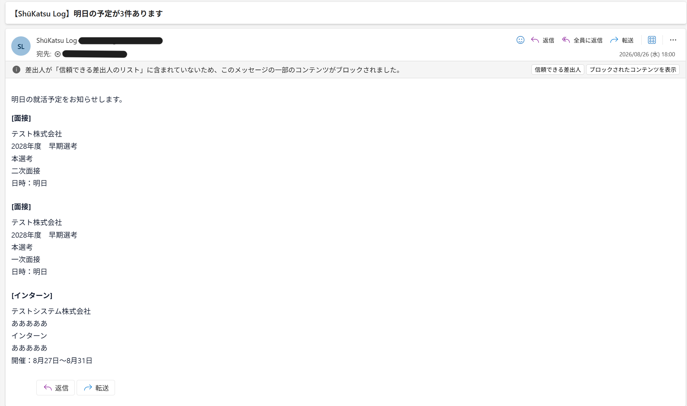
</p>

Supabase Cron・Edge Functions・Resendを組み合わせ、
定期的に通知対象を確認してメールを送信しています。

---

# 主な機能

- 企業情報管理
- インターン・本選考管理
- 選考ステップ管理
- ES質問・回答記録
- 面接質問・回答記録
- 就職活動カレンダー
- 前日のメール通知
- Geminiを利用したAI分析
- AI分析履歴
- ログイン・ユーザー認証
- レスポンシブ対応

---

# 使用技術

| 分野 | 使用技術 |
|---|---|
| Frontend | HTML / CSS / JavaScript / Vite |
| Backend | Supabase |
| Database | PostgreSQL |
| Authentication | Supabase Auth |
| Security | Row Level Security |
| Server | Supabase Edge Functions |
| AI | Google Gemini API |
| Mail | Resend |
| Scheduler | Supabase Cron |
| Deploy | Vercel |
| Version Control | Git / GitHub |

---

# 工夫・改善した点

## 1. AI分析では「実際の回答」を優先

AI分析では当初、
実際の回答と本人の振り返りを同じようにAIへ渡していました。

しかし、

> 「うまく答えられなかった」

という自己評価だけで、
AIまで「説明力が弱い」と判断してしまう可能性がありました。

そこで、AIへ渡す情報を3種類に分類しました。

| 分類 | 内容 |
|---|---|
| PRIMARY_EVIDENCE | ES・面接の実際の質問と回答 |
| OBJECTIVE_FACTS | 選考結果などの客観的事実 |
| SELF_REFLECTION | 本人による振り返り |

AI分析では、
**PRIMARY_EVIDENCEを最も重要な根拠として扱う**
ようにしています。

さらに、Geminiが返した分析結果についても、
実際に存在する回答を根拠としているか
サーバー側で確認する仕組みを追加しました。

単純に生成AIを利用するだけではなく、

> **AIが何を根拠として判断したのか**

まで意識して設計しています。

---

## 2. 実際のインターン日程に合わせた設計

当初はインターンを
「開始日～終了日」の1期間だけ登録する設計でした。

しかし実際には、
複数の日程に分かれて開催される場合があります。

そこで複数の開催期間を登録できるよう
データ構造を変更しました。

変更した日程情報は、

- インターン管理
- カレンダー
- 前日メール通知

でも共通して利用しています。

そのため、
登録された実際の開催日だけを
カレンダーや通知に反映できるようになっています。

---

## 3. 前日メール通知の自動化

就職活動では、
面接・インターンなど重要な予定を忘れないことが重要です。

そこで、
Supabase Cron・Edge Functions・Resendを組み合わせ、
前日にメールを自動送信する仕組みを実装しました。

処理の流れは以下です。

```text
Supabase Cron
      ↓
定期的にEdge Functionを実行
      ↓
通知設定と予定を確認
      ↓
翌日の通知対象を抽出
      ↓
Resend
      ↓
ユーザーへメール送信
```

単純にメールを送信するだけではなく、
同じ予定について通知が重複して送られないよう、
通知履歴も利用して制御しています。

また、インターンが複数期間に分かれている場合でも、
実際の各開催日の前日に通知できるようにしています。

例えば、

```text
9月5日～6日
9月12日～13日
```

というインターンであれば、
実際の開催日に対応して通知対象を判断します。

自動処理については、
実際にCronから処理を実行し、
メールが届くところまで動作確認を行いました。

---

## 4. RLSによるユーザーデータの保護

ShūKatsu Logでは、

- 企業情報
- 応募情報
- ES
- 面接回答
- 選考結果

など、
ユーザーごとに分離する必要がある情報を扱います。

そのためSupabaseの
**Row Level Security（RLS）**
を利用しています。

フロントエンド上でデータを隠すだけではなく、
データベース側でアクセスを制御しています。

複数のテストユーザーを利用して、

- SELECT
- INSERT
- UPDATE
- DELETE
- 他ユーザーのデータへの付け替え

などを実際に試し、
他ユーザーのデータを操作できないことを確認しています。

---

## 5. APIキーなどの機密情報をフロントエンドから分離

Gemini・Resendなどの処理では、
外部サービスのAPIキーを使用します。

これらの機密情報を
ブラウザ側のJavaScriptへ直接記述すると、
利用者から確認できてしまう危険があります。

そのため、

- Gemini APIキー
- Resend APIキー
- Supabase Service Role Key
- Cron実行用Secret

などの機密情報は
フロントエンドには配置せず、
Supabase Edge Functions側のSecretsで管理しています。

一方、フロントエンドでは
公開利用を前提としたSupabaseの情報のみを使用しています。

---

## 6. CronからEdge Functionへのアクセス制御

メール通知用のEdge Functionが
誰からでも自由に実行できないよう、
Cronからのリクエストを確認するためのSecretを使用しています。

これにより、
通知処理用のエンドポイントを
単純に外部へ公開するだけではなく、
許可された処理からの実行であることを確認しています。

---

## 7. エラー発生時のフォールバック

プロフィール情報の取得に
一時的な通信エラーが発生した場合、
以前はログイン後の画面全体が
表示されなくなる問題がありました。

そこでプロフィール情報を取得できなかった場合は、

> 「ユーザー」

という表示名へフォールバックし、
その他の画面表示やデータ取得処理を継続するよう改善しました。

一部の通信エラーによって、
アプリ全体が利用できなくならないことを意識しています。

---

## 8. スマートフォン対応

PCだけでなく、
スマートフォンでも利用できるよう
レスポンシブ対応を行っています。

320px程度の画面幅から確認し、

- ダッシュボード
- ログイン導線
- AI分析
- サマリーカード
- 入力フォーム

などを調整しています。

<p align="center">
  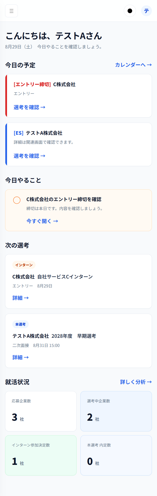
  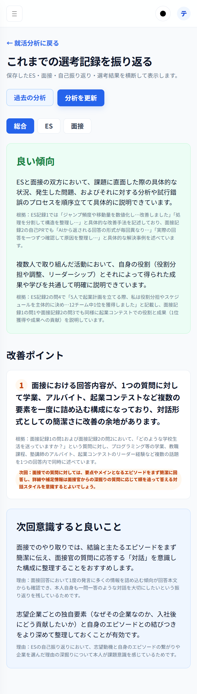
</p>

---

## 9. GitHubを利用したチーム開発

3人で同じWebアプリを開発するため、
Git / GitHubを利用して共同開発を行っています。

GitHubを利用することで、

- ソースコードの共有
- 変更履歴の管理
- 複数人での並行開発
- 実装内容の確認
- コードレビュー
- 変更内容を確認した上での統合

を行っています。

自分はリーダーとして、
各メンバーの作業状況を確認しながら、
次に必要な作業を整理して開発を進めています。

---

# セキュリティ面で意識したこと

就職活動に関する情報を扱うため、
機能実装だけでなく、
ユーザーごとのデータ保護や秘密情報の管理も意識しています。

| 対策 | 内容 |
|---|---|
| ユーザー認証 | Supabase Authを利用 |
| データアクセス制御 | Row Level Securityを利用 |
| RLSテスト | 複数ユーザーで他ユーザーのデータへアクセスできないことを確認 |
| APIキー管理 | Gemini・ResendなどのSecretをEdge Functions側で管理 |
| DB管理用キー | Service Role Keyをフロントエンドへ公開しない |
| Cron保護 | Secretを利用して通知Functionへのアクセスを確認 |
| AI分析 | Geminiの出力をそのまま信用せず、根拠情報をサーバー側で確認 |
| エラー対策 | 一部通信失敗でもアプリ全体が停止しないようフォールバック |

現在はβ版のため、
一般公開に向けたセキュリティ確認については
引き続き進めています。

---

# システム構成

<p align="center">
  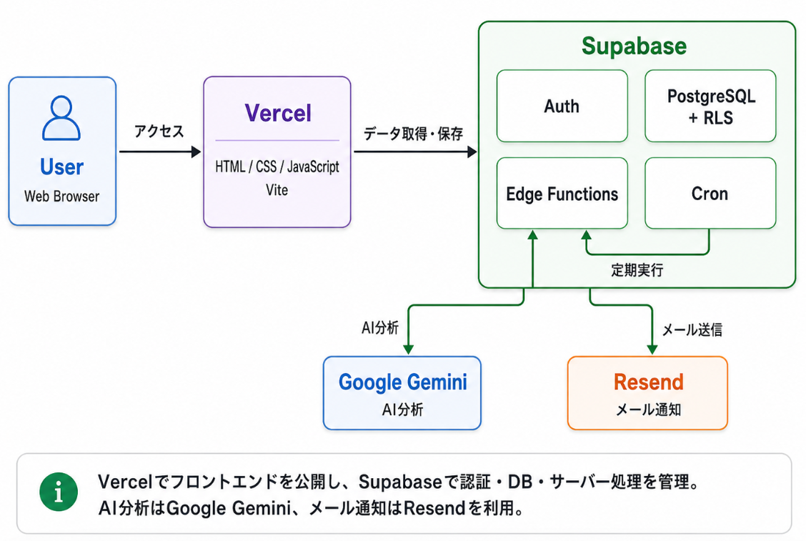
</p>

```text
User
 │
 ▼
Vercel
 │
 ▼
HTML / CSS / JavaScript / Vite
 │
 ▼
Supabase
 ├─ Auth
 ├─ PostgreSQL + RLS
 ├─ Edge Functions
 └─ Cron
      │
      ├─────────────┐
      ▼             ▼
Google Gemini     Resend
AI分析            メール通知
```

---

# チーム開発を通して学んだこと

本制作では、
3人で要件を考えたうえで、
それぞれの担当機能を開発しています。

共同開発を通して、

- GitHubを利用した共同開発
- 複数人での並行開発
- コードレビュー
- 変更内容を確認して統合すること
- 他のメンバーが読みやすいコードを意識すること
- メンバー間で認識を合わせること

を経験しました。

また、リーダーとして、

- 必要な作業を整理する
- メンバーへ担当を割り振る
- 進捗を確認する
- メンバーの意見を整理する
- チーム全体として次に行うことを判断する

ことも経験しました。

技術面だけでなく、
複数人で1つのWebアプリを開発するための
進行管理やコミュニケーションの重要性も学びました。

---

# 今後の展望

現在はβ版として継続開発しています。

今後は、

- ES作成支援
- 面接前の想定質問・振り返り支援
- AI分析の高度化
- 選考通過率などのデータ可視化
- 通知タイミングのカスタマイズ
- UX・アクセシビリティ改善
- E2Eテスト
- セキュリティ確認の継続
- 利用規約・プライバシーポリシーの整備
- 正式公開に向けた運用体制の整備

などを進める予定です。

---

# 制作状況

| 項目 | 状況 |
|---|---|
| 基本機能 | 完了 |
| 認証・DB連携 | 完了 |
| AI分析 | 完了 |
| メール通知 | 完了 |
| Cronによる自動通知 | 完了 |
| レスポンシブ対応 | 完了 |
| Vercel β公開 | 完了 |
| セキュリティ確認 | 継続中 |
| 正式公開対応 | 今後実施 |

---

# 公開URL

🌐 **[ShūKatsu Log β版](https://shukatsu-log-nu.vercel.app)**

---

# ソースコードについて

現在β版として継続開発しているため、
アプリケーション本体のソースコードは
Private Repositoryで管理しています。

本リポジトリでは、

- 制作物の概要
- 主な画面
- 使用技術
- 開発体制
- 自分の担当・役割
- AI分析の工夫
- 通知機能
- セキュリティ面の工夫
- チーム開発で学んだこと
- 今後の展望

を公開しています。

---

# 制作期間

**継続開発中**